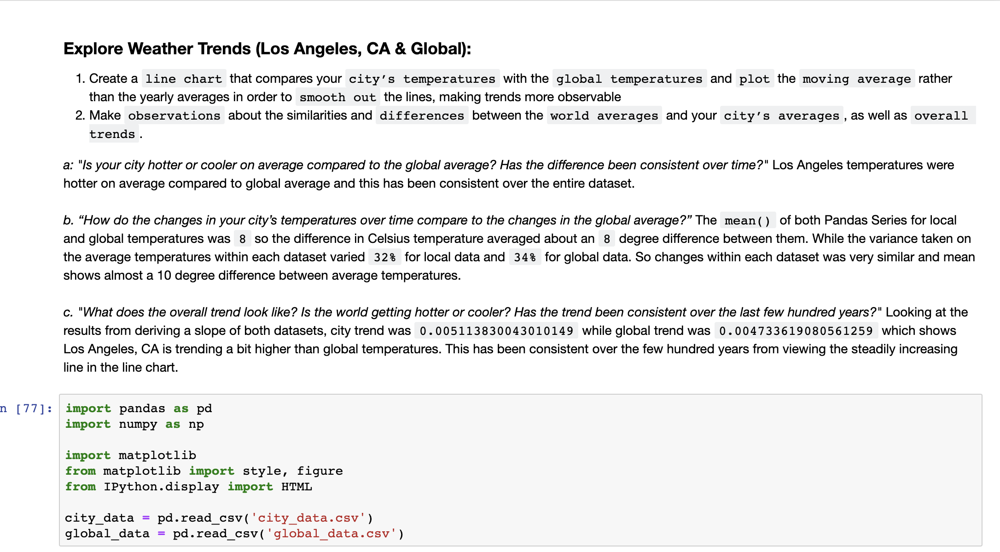
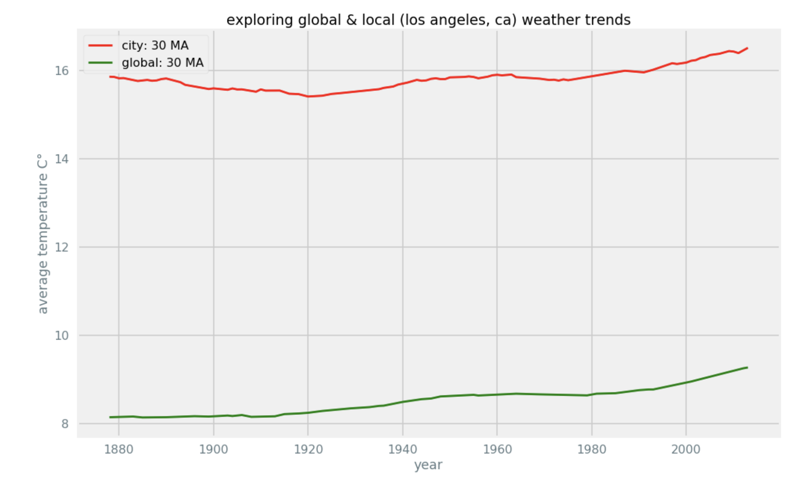

# Udacity-Weather-Trends
_Los Angeles, CA and Global Temperatures Weather Trends and Line Plot_

### In the "Explore Weather Trends" project for Udacity's Data Analyst Nanodegree I learned how to calculate moving averages, and trend lines, while utilizing Python libraries like matplotlib to visualize datasets. Next iterations and projects moving forward I'll dive deeper into more advanced ways to plot using plotly and other statistical techniques. 

### Calculated local and global temperatures to get the moving average over a 30 day window and implemented a line chart using matplotlib!

